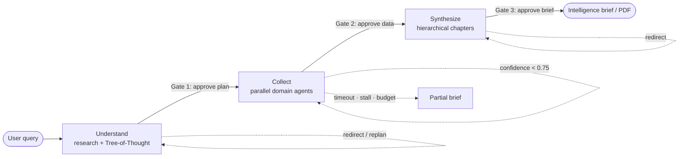
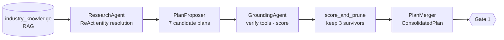
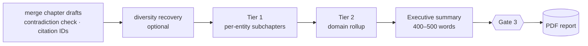

# Komatsu Market Intelligence Agent

An agentic market-intelligence assistant that monitors Komatsu's competitive landscape across **seven intelligence domains** — Competition, Distributors, Customers, Mining Projects, Commodities, Macro & Geopolitics, and General Search — and turns open-web and financial signals into on-demand intelligence briefs, with a human kept firmly in the loop.

Built as a capstone for the Carnegie Mellon **Agentic AI** course. The system is split into two tiers: a **Blazor WebAssembly** frontend (a thin client with no business logic) and a **FastAPI / Python** backend that does all of the reasoning, retrieval, and tool execution.

What makes it more than a chatbot:

- **Tree-of-Thought planning** — proposes seven candidate research strategies, grounds them against the tools that actually exist, and prunes to the three strongest before spending a cent on data.
- **Parallel domain sub-agents** — each intelligence domain is collected by its own agent, in parallel, with an LLM-driven self-repair loop when a tool call fails.
- **Three human approval gates** — the user reviews the plan, the collected data, and the final brief before each phase commits.
- **Multi-stage RAG** — retrieval grounds planning, captures collected evidence, and feeds synthesis.
- **Live progress** — the UI streams the plan tree, sources, tokens, and cost as the run unfolds.

> **A note on naming.** The product is the *Komatsu Market Intelligence Agent*. For historical reasons the repository root is still titled `MarketResearchAgent` and the frontend project is `KomatsuIntel.Frontend`.

---

## Architecture overview

The backend is a **LangGraph state machine** ([`backend/core/graph.py`](backend/core/graph.py) — 9 nodes plus routers) that carries a single `AgentState` object through three phases. Between phases sit three human gates; a ReAct-style controller can backtrack when confidence is low, and a partial-brief escape hatch guarantees the user always gets *something* back.



Core building blocks:

| Concern        | Choice                                                              |
| -------------- | ------------------------------------------------------------------- |
| Orchestration  | LangGraph state machine + SQLite checkpointer                       |
| LLM            | Mistral (`mistral-medium-latest`) via an async client + CrewAI/LiteLLM |
| Agents         | CrewAI (grounding, per-domain collection, synthesis)                |
| Memory         | ChromaDB (vectors) + SQLite (runs, events, figures, preferences)    |
| Data           | Tavily web search + ~30 structured tools (financials, news, SEC, FRED, commodities) |

### 1. Understand

> `understand_node` in [`backend/core/graph.py`](backend/core/graph.py); [`core/research_agent.py`](backend/core/research_agent.py), [`core/tot/`](backend/core/tot/), [`core/plan_merger.py`](backend/core/plan_merger.py)



The ResearchAgent runs a bounded ReAct loop (web/news search, extraction, master-data lookup) to resolve the entities and market context behind the question. `PlanProposer` then generates **7** candidate research plans at high temperature (0.9); `GroundingAgent` (a CrewAI critic) checks each plan's tool calls against the real tool registry, substitutes or drops what is unavailable, and scores **feasibility (60%)** and **quality (40%)**. `score_and_prune` keeps the **3** best, and `PlanMerger` consolidates them into a single `ConsolidatedPlan` — domains to activate, an entity manifest, per-entity *leaves*, and the flattened list of planned tool calls. That plan, rendered as a **domain → entity → tools** tree, is what the user approves at **Gate 1**.

### 2. Collect

> `collect_node` in [`backend/core/graph.py`](backend/core/graph.py); [`agents/base_domain_agent.py`](backend/agents/base_domain_agent.py), [`core/tool_router.py`](backend/core/tool_router.py)

For every `(surviving plan × active domain)` pair, a `BaseDomainAgent` runs in parallel. Each agent filters the plan down to its domain's tool calls and executes them through the **tool router**, which enforces the allowlist, applies a per-run **circuit breaker** (a tool is blocked after 5 logical failures, or immediately on a 429), and logs each source live so the UI's Sources panel grows tool-by-tool. When a call fails transiently, an **LLM-driven repair loop** adapts the arguments and retries up to 4 times (with a dedicated FRED series-discovery fallback). Raw results are handed to a CrewAI agent that extracts structured prose into a `ChapterDraft`; that text is chunked into a per-run Chroma collection, `collected_{run_id}`.

Confidence is `successful_domains / total_domains`. Below **0.75**, the graph silently backtracks and re-runs the weak domains (reusing good drafts) before surfacing **Gate 2**, where the user reviews the actual collected datasets, tables, and any failed tools.

### 3. Synthesize

> `synthesize_node` in [`backend/core/graph.py`](backend/core/graph.py); [`core/merger.py`](backend/core/merger.py), [`agents/synthesis_agent.py`](backend/agents/synthesis_agent.py)



Parallel chapter drafts are merged with contradiction detection and assigned stable, global citation IDs. If chapters overlap too heavily, an optional **diversity-recovery** step pulls in a distinct non-survivor plan. Synthesis is **hierarchical**: Tier-1 writes a focused subchapter per entity, Tier-2 rolls those up into a domain chapter, and a final pass produces a 400–500-word executive summary. Throughout, RAG re-retrieves the run's `collected_{run_id}` evidence as context — with a prompt-injection scan that filters tainted chunks before they reach the LLM. After **Gate 3**, the brief is rendered to PDF (ReportLab) — see [Sample output](#sample-output).

---

## Sample output

A full brief generated by the system is committed for reference:

📄 **[sampleOutput/komatsu-brief-60bc664b-0bcf-40c7-8816-9d5c6a57aeb2.pdf](sampleOutput/komatsu-brief-60bc664b-0bcf-40c7-8816-9d5c6a57aeb2.pdf)**

It shows the assembled deliverable — executive summary, per-domain chapters with figures, and numbered citations — exactly as produced after Gate 3 and rendered to PDF. At runtime, new briefs land in `backend/outputs/` (gitignored) and are downloadable from the UI's **Report** page or via `GET /runs/{run_id}/report`.

---

## Key design choices

| Decision | Where | Why |
| --- | --- | --- |
| **Tree-of-Thought planning** | [`core/tot/`](backend/core/tot/) | Explore diverse research strategies before committing; pruning to 3 survivors bounds cost and latency. |
| **CrewAI agents** | [`agents/`](backend/agents/) | Role/goal/backstory agents for grounding, per-domain extraction, and hierarchical synthesis — structured reasoning over raw tool output. |
| **LangGraph orchestration** | [`core/graph.py`](backend/core/graph.py) | A durable, interruptible state machine is what makes gates, backtracking, and checkpoint/resume possible. |
| **Multi-stage RAG (ChromaDB)** | [`retrieval/`](backend/retrieval/) | Three touchpoints: `industry_knowledge` grounds planning (Understand); `collected_{run_id}` captures evidence (Collect); both feed Synthesize. An optional `episodic_memory` of past runs is gated by `STORES__EPISODIC_ENABLED` (off by default). |
| **Human-in-the-loop gates** | [`api/routers/gates.py`](backend/api/routers/gates.py), graph interrupts | Gate 1 (plan), Gate 2 (data), Gate 3 (brief); each supports *approve* or *redirect/replan*. `SAFETY__AUTO_APPROVE_GATES` bypasses them in dev. |
| **Guardrails & safety** | [`core/guardrails.py`](backend/core/guardrails.py), [`core/tool_circuit_breaker.py`](backend/core/tool_circuit_breaker.py) | Per-run spend and API-call caps, tool circuit breaker, a 15-min soft timeout and ~210s stall watchdog (both interrupt → partial brief), plus a prompt-injection scan on retrieved text. |
| **Live updates via 2s polling** | [`Agent.razor`](frontend/KomatsuIntel.Frontend/Pages/Agent.razor) → `GET /runs/{id}` | A deliberate trade-off: polling is far simpler than SSE/WebSocket for a WASM client, at the cost of some latency and chattiness. |
| **Single config surface** | [`config/settings.py`](backend/config/settings.py) | All tuning lives in pydantic-settings with `__`-nested env vars; no module outside `config/` reads the environment. |

---

## Repository structure

```text
.
├── README.md            # this file
├── AGENTS.md            # deep design rationale & build plan
├── backend/             # FastAPI + Python — all reasoning lives here
└── frontend/            # Blazor WebAssembly client
```

### Backend

The backend is layered by responsibility, so a request flows *inward* from HTTP to reasoning to raw I/O and back. The organizing principle: **`clients/` make raw HTTP calls, `tools/` wrap them as agent-facing functions, and `services/` hold cross-cutting business logic.**

```text
backend/
├── main.py          # entry point — uvicorn on 0.0.0.0:8000
├── api/             # FastAPI app, routers (chat, gates, knowledge, sessions, …), schemas
├── core/            # the reasoning spine: LangGraph graph, Tree-of-Thought, mergers, routers, guardrails
├── agents/          # CrewAI agents (grounding, base domain collection, synthesis)
├── tools/           # ~30 agent-facing tools + registry (financials, news, SEC, FRED, commodities, RAG)
├── clients/         # raw HTTP clients for external APIs (yfinance, FMP, NewsAPI, EDGAR, FRED, …)
├── services/        # business logic (master data, async knowledge-ingest jobs)
├── retrieval/       # RAG: ChromaDB wrapper, chunking, document conversion
├── memory/          # SQLite store (runs, events, figures, preferences) + context-window tracking
├── models/          # LLM client (Mistral wrapper)
├── prompts/         # prompt templates & tool schemas
├── reports/         # report assembly + PDF generation (ReportLab)
├── state_bus/       # FastMCP server for shared planning state
├── config/          # settings.py — the single tuning surface
├── data/            # version-controlled master data + knowledge corpus
├── outputs/         # runtime artefacts (SQLite, Chroma, PDFs) — gitignored
└── tests/           # pytest unit + integration suites
```

### Frontend

```text
frontend/KomatsuIntel.Frontend/   # Blazor WASM (.NET 8, MudBlazor 7.6.0)
├── Pages/        # Index (daily brief), Agent (chat + gates), Archive, Dashboard, Testing, Preferences, Report
├── Components/   # CollectionPlan, GatheredData, PlanReview, BriefReview (the gate UIs)
└── Services/     # ApiClient.cs — typed wrapper over the backend REST API
```

The client holds no business logic: every action is an HTTP call, and `Agent.razor` polls `GET /runs/{id}` every two seconds to render live plan, sources, and cost updates.

---

## Getting started

### Prerequisites

- Python 3.11+
- .NET 8 SDK
- API keys for the external services (see [Configuration](#configuration))

### Backend

```bash
cd backend
python -m venv venv
source venv/bin/activate          # Windows: venv\Scripts\activate
pip install -r requirements.txt
cp .env.example .env              # then fill in your API keys
python main.py                    # serves http://localhost:8000
```

### Frontend

```bash
cd frontend/KomatsuIntel.Frontend
dotnet run                        # backend URL set in wwwroot/appsettings.json (default http://localhost:8000/)
```

Both tiers must be running for the system to work — start the backend first, then the frontend.

---

## Configuration

Configuration is driven by environment variables loaded through [`backend/config/settings.py`](backend/config/settings.py) (pydantic-settings, `__`-nested keys). Copy [`backend/.env.example`](backend/.env.example) to `backend/.env` and fill in:

| Variable | Purpose | Provider / get a key |
| --- | --- | --- |
| `LLM__PROVIDER`, `LLM__MODEL` | LLM provider (`mistral`) and model override (defaults to `mistral-medium-latest`) | [Mistral AI](https://mistral.ai/) |
| `MISTRAL_API_KEY` | Mistral API key (reasoning + synthesis) | [console.mistral.ai](https://console.mistral.ai/api-keys/) |
| `ALPHA_VANTAGE_API_KEY` | Stock screener / technical data | [Alpha Vantage](https://www.alphavantage.co/support/#api-key) |
| `FMP_API_KEY` | Financial Modeling Prep — company financials | [Financial Modeling Prep](https://site.financialmodelingprep.com/developer/docs) |
| `NEWSAPI_API_KEY` | News search | [NewsAPI](https://newsapi.org/register) |
| `SEC_EDGAR_API_KEY` | SEC EDGAR filings & press releases | [SEC EDGAR APIs](https://www.sec.gov/search-filings/edgar-application-programming-interfaces) |
| `TAVILY_API_KEY` | Web search / research / extraction | [Tavily](https://app.tavily.com/) |
| `FRED_API_KEY` | Federal Reserve macro & commodity series | [FRED API keys](https://fredaccount.stlouisfed.org/apikeys) |
| `STORES__SQLITE_PATH`, `STORES__CHROMA_PATH` | Override the on-disk store locations | — |
| `SAFETY__AUTO_APPROVE_GATES` | *Dev only* — skip the human gates | — |
| `SAFETY__ALLOW_NETWORK_WRITES` | *Dev only* — relax the network-write guard | — |

Everything else — ToT branching factor, gate toggles, timeouts, spend/budget caps, retrieval parameters — is tunable in `config/settings.py`, which is the single source of truth.

---

## Testing

The backend is tested with `pytest` (plus `pytest-asyncio` and `pytest-mock`):

```bash
cd backend
pytest tests/unit                 # unit tests, organized by module
pytest tests/integration          # clarification, multi-agent collect, full e2e
pytest tests -k chat              # filter by keyword
```

For interactive checks, the app's **Testing** page and the backend's `POST /tests/run/*` endpoints exercise individual tools and the LLM end-to-end.

---

## Strengths, limitations & next steps

> _Starting draft — to be refined by the team._

### Strengths

- Diverse, cost-bounded planning via Tree-of-Thought (7 proposed → 3 executed).
- Parallel per-domain collection with an LLM-driven self-repair loop and circuit breaking.
- Genuine human-in-the-loop control at three decision points.
- Multi-stage RAG with global citation tracking and prompt-injection filtering.
- Live progress (plan tree, sources, tokens, cost) streamed to the UI.
- Resilient by design: budget caps, soft timeout, stall watchdog, and a partial-brief fallback.
- Single configuration surface and broad tool coverage (financial, news, SEC, FRED, commodities, web).

### Limitations / not yet working

- `POST /chat/stream` is not implemented — the UI relies on 2-second polling.
- Episodic memory across runs is disabled by default (`STORES__EPISODIC_ENABLED=false`).
- The LangGraph checkpoint DB is forced outside the project directory because iCloud/Drive-synced folders break SQLite WAL locking.
- The LLM provider is effectively hard-typed to Mistral; there is no provider abstraction yet.
- No Docker, CI pipeline, or solution (`.sln`) file.
- `AGENTS.md` has drifted from the current code in a few places (page count, `mcp/` → `state_bus/`, episodic default, time limits).
- The 7-plan proposal plus parallel agent fan-out can be costly and slow on broad queries.

### Next steps

- Implement true streaming (SSE/WebSocket) to replace polling.
- Add a CI pipeline and containerization.
- Reconcile `AGENTS.md` with the implemented system.
- Introduce an LLM-provider abstraction.
- Harden and enable episodic memory.
- Build an evaluation harness for plan quality and brief accuracy.

---

## Further reading

See [`AGENTS.md`](AGENTS.md) for the full design rationale and original build plan behind the architecture summarized here.
